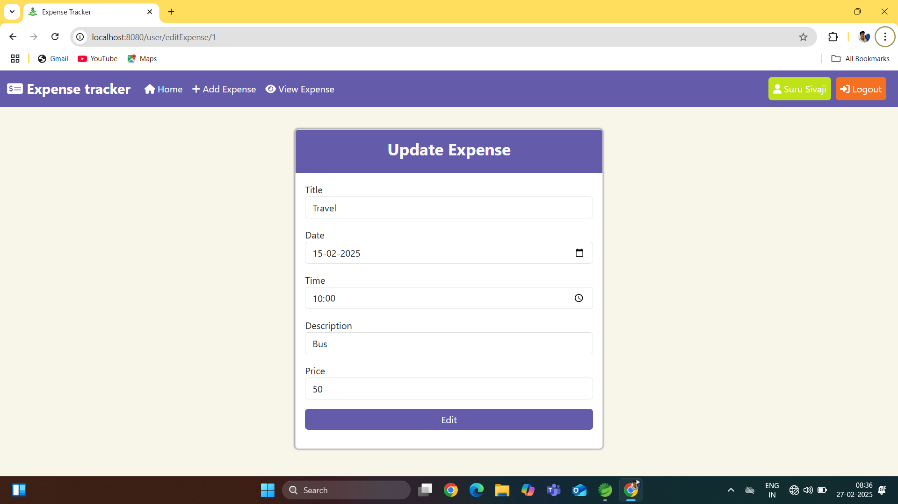

<h2 align="center">🌟 Expense Tracking System 🌟</h2>

This Expense Tracking System is a web application developed using <strong>Spring MVC</strong>, <strong>Spring Data JPA</strong>, <strong>HTML</strong>, <strong>CSS</strong>, <strong>Bootstrap</strong> and <strong>MySQL</strong>. The application provides users with a seamless way to manage and track their expenses while incorporating robust features like user authentication, expense management, profile updating, and password recovery.

---

<h3 align="center">📂 Project Structure</h3>

The project is structured into three main layers:

<ol>
    <li><b>Repository Layer:</b>Repository layer contains the interfaces these are used for performing database operations because in spring we not providing these implementation these implementation providing by the spring. Here i am using two repositories those are user repository and expense repository.</li>
    <li><b>Controller Layer:</b> Controller layer controller classes contains the methods which are used for handle Http requests and Http responses. Here i am using two controller classes those are user controller and home controller.</li>
    <li><b>Model Layer:</b> Contains entity classes representing database tables. These classes allow Hibernate to map Java objects to database tables, facilitating efficient database operations. Here i am using two entity classes those are User and Expenses</li>
</ol>

---

<h3 align="center">🌟 Features</h3>

<h4>1. User Account Management</h4>
<ul>
    <li><b>User Registration:</b> New users can register by providing their details, which are securely stored in the database.</li>
    <li><b>View User Details:</b> Users can verify and manage their account information.</li>
    <li><b>Login and Authentication:</b> Validates user credentials for secure login.</li>
    <li><b>Forgot Password:</b> Helps users reset their password via a secure process.</li>
</ul>
<h4>2. Expense Management</h4>
<ul>
    <li><b>Add Expenses:</b> Record new expenses with details like amount, category, date, and description.</li>
    <li><b>Edit Expenses:</b> Update existing records for accurate tracking.</li>
    <li><b>Delete Expenses:</b> Remove unnecessary or outdated records.</li>
    <li><b>View Expenses:</b> Display a list of recorded expenses with sorting and filtering options.</li>
</ul>

<h4>3. Session-based Messaging</h4>

Key actions within the application (login, expense management, etc.) display success or failure messages to users for feedback.

<h2 align="center">🛠️ Technologies Used</h2>
<ul>
    <li><strong>Frontend:</strong> HTML, CSS, JavaScript</li>
    <li><strong>Backend:</strong> Spring Boot, Spring MVC, Spring Data JPA</li>
    <li><strong>Database:</strong> MySQL</li>
</ul>

---

<h3 align="center">📸 Screenshots</h3>

Below are some screenshots showcasing the key features of the application:

    
    
<b>Figure 1:</b> Index Page

    
    
<b>Figure 2:</b> User Registration Page

    
    
<b>Figure 3:</b> User Login Page

    
    
<b>Figure 4:</b> Forgot Password Page

    
    
<b>Figure 5:</b> Change Password Page

    
    
<b>Figure 6:</b> Home Page

    
    
<b>Figure 7:</b> View Expenses Page

    
    
<b>Figure 8:</b> Add Expense Page

    
    
<b>Figure 9:</b> Edit Expense Page

    
    
<b>Figure 10:</b> Remove Expense Page

    
    
<b>Figure 11:</b> View Profile Page

    
    
<b>Figure 12:</b>Profile Page

    
    
<b>Figure 13:</b> Logout Account Page

---

<h3 align="center">🎉 Enjoy tracking your expenses!</h3>

